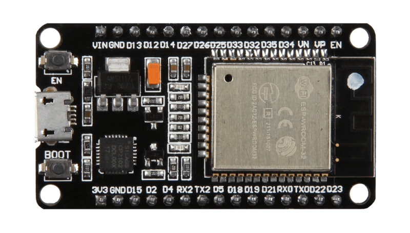
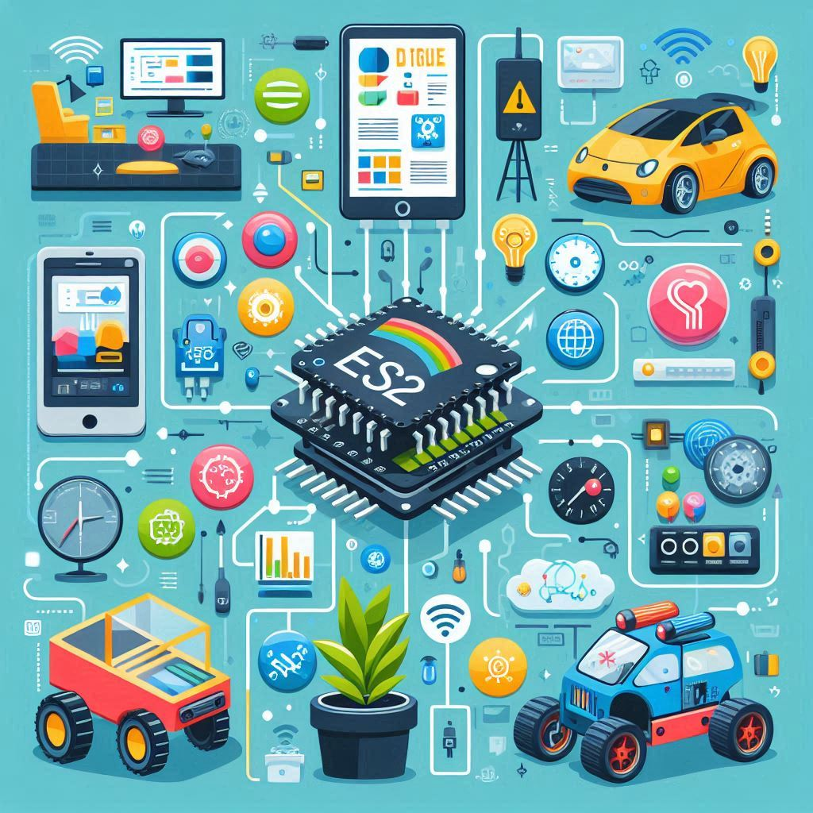
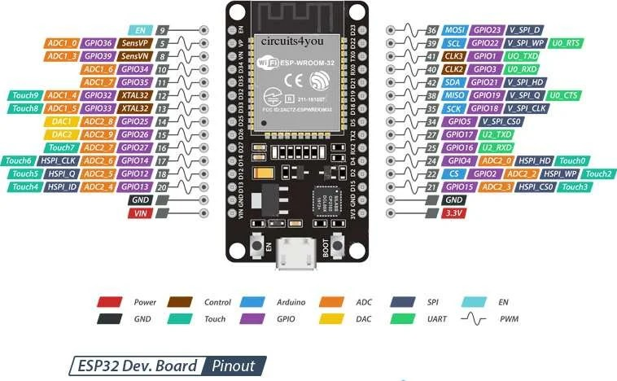
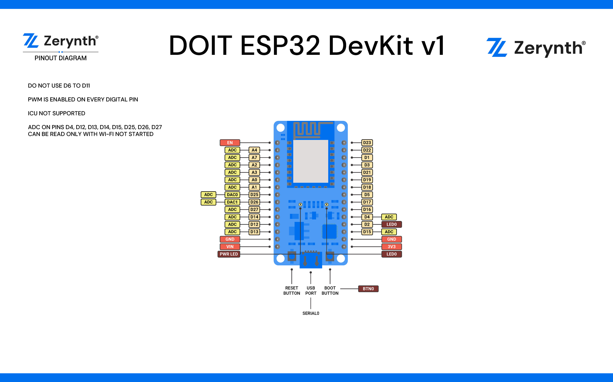
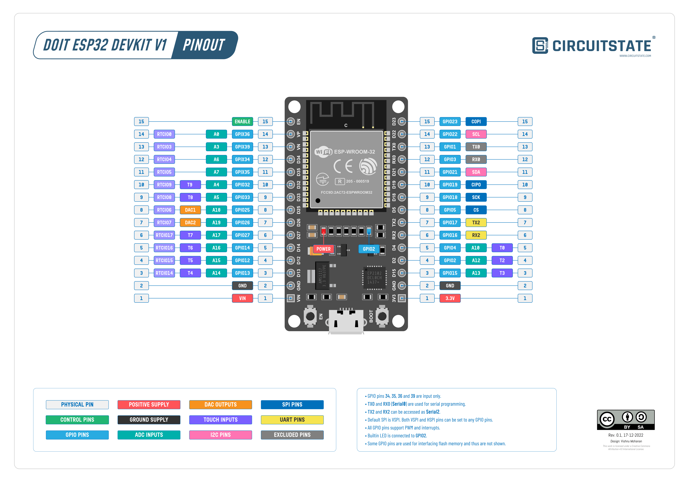

# Introduction to ESP32
 

## What is a Microcontroller?

- **Imagine a tiny computer that can be programmed to perform specific tasks.**
- **Microcontrollers are used in a wide range of electronic devices, from your TV remote to your microwave.**

## Introducing the ESP32
- **The ESP32 is a powerful microcontroller developed by Espressif Systems.**
- **It's not just any microcontroller; it's like a mini-computer with built-in Wi-Fi and Bluetooth capabilities.**

## Understanding ESP32 Features

### What Can ESP32 Do?

- **The ESP32 can perform a variety of tasks, including**
    - Processing data and making decisions (like a brain).
    - Connecting to Wi-Fi networks to access the internet.
    - Communicating with other devices via Bluetooth.
    - Interfacing with sensors, motors, and other components.

- **Key Features of ESP32**
    - Dual-core processor for faster performance
    - Integrated Wi-Fi (802.11b/g/n) for wireless internet connectivity.
    - Dual-mode Bluetooth (Classic and BLE) for communication with other devices.
    - GPIO pins for connecting to external components like sensors, LEDs, and displays.

| Parameter              | Specification                 |
|------------------------|-------------------------------|
| Wireless Protocol      | Wireless 802.11b/g/n standard |
| Bluetooth Version      | BLE 4.0                       |
| Operating Frequency    | 2.4 GHz to 2.5 GHz            |
| Data Transmission Rate | 150 Mb/s                      |
| Output Power           | 20 dBm                        |
| Operating Voltage      | 2.7 – 3.6V                    |
| Operating Temperature  | -40 to 85 °C                  |
| Dimension              | 52 mm x 28 mm x 14 mm         |
| Weight                 | 10 g                          |

- Development board based on ESP-WROOM-32 module (DOIT version)
- 30 GPIOs
- ESP32 is a dual core 32-bit processor with built-in 2.4 GHz Wi-Fi and Bluetooth
- 4MByte flash memory
- 520KByte RAM
- 2.2 - 3.6V Operating voltage range
- In breadboard friendly breakout
- USB microB for power and Serial communication, use to load program and serial debugging too
  
## Why Choose ESP32?

- **Advantages of ESP32**
    - **Versatility**: The ESP32 can be used in a wide range of applications due to its powerful features.
    - **Connectivity**: Its built-in Wi-Fi and Bluetooth capabilities enable seamless communication with other devices.
    - **Low Power Consumption**: Despite its capabilities, the ESP32 is energy-efficient, making it suitable for battery-powered devices.
    - **Community Support**: There's a large and active community of developers sharing resources, libraries, and tutorials for the ESP32.

## Exploring ESP32 Pins

- **Physical Layout**
  - The ESP32 comes in various development boards, each with its own layout of pins.
  - These pins serve as connection points for interfacing with external components.

- **Pin Functions**
  - Different pins have different functions, such as input, output, power, and communication.
    - Understanding the pinout diagram is crucial for connecting external components correctly.

    ### Understanding ESP32 Pins
  
  
  
## Power & Control
   
| Pin Name | Function                                                                                                                                                  |
|----------|-----------------------------------------------------------------------------------------------------------------------------------------------------------|
| VIN      | The input of the 3.3V positive voltage regulator. Supply voltage in the range of 4 to 12V.                                                                |
| 3.3V     | Output from the voltage regulator. You can also supply 3.3V to this pin if you have one. But do not supply both VIN and 3V3 together.                     |
| GND      | Ground (Negative) supply pins.                                                                                                                            |
| ENABLE   | This is the reset pin. Connecting this pin to GND will reset the ESP32. This pin is normally pulled-up. The EN button will pull it LOW when you press it. |

### GPIO(GENERAL PURPOSE INPUT OUTPUT)
  
There are 34 GPIO pins available on the ESP32 chip. These pins are named from 0 to 39.

| GPIO        | Input? | Output? | Notes                                                                               |
|-------------|--------|---------|-------------------------------------------------------------------------------------|
| 0           | NO     | YES     | Pull LOW to enter bootloader mode.                                                  |
| GPIO1(TX0)  | NO     | YES     | TX0 of serial port for programming and printing debug messages.                     |
| GPIO2(D2)   | YES    | YES     | Connected to the onboard LED, must be left floating or LOW to enter flashing mode.  |
| GPIO3(RX0)  | YES    | NO      | RX0 of serial port for programming and printing debug messages.                     |
| GPIO4(D4)   | YES    | YES     | Strapping pin                                                                       |
| GPIO5(D5)   | NO     | NO      | Flash memory interface. Do not use.                                                 |
| 6           | NO     | NO      | Flash memory interface. Do not use.                                                 |
| 7           | NO     | NO      | Flash memory interface. Do not use.                                                 |
| 8           | NO     | NO      | Flash memory interface. Do not use.                                                 |
| 9           | NO     | NO      | Flash memory interface. Do not use.                                                 |
| 10          | NO     | NO      | Flash memory interface. Do not use.                                                 |
| 11          | NO     | NO      | Flash memory interface. Do not use.                                                 |
| GPIO12(D12) | YES    | YES     | Strapping pin. Booting can fail if pulled HIGH (for 3.3V memories) due to brownout. | 
| GPIO13(D13) | YES    | YES     |                                                                                     |
| GPIO14(D14) | YES    | YES     |                                                                                     |
| GPIO15(D15) | YES    | YES     | Pulling LOW mutes the debug messages through the serial port.                       |
| GPIO16(RX2) | YES    | YES     |                                                                                     |
| GPIO17(TX2) | YES    | YES     |                                                                                     |
| GPIO18(D18) | YES    | YES     |                                                                                     |
| GPIO19(D19) | YES    | YES     |
| 20          | -      | -       |                                                                                     |
| GPIO21(D21) | YES    | YES     |                                                                                     |
| GPI022(D22) | YES    | YES     |                                                                                     |
| GPIO23(D23) | YES    | YES     |                                                                                     |
| 24          | -      | -       |                                                                                     |
| GPIO13(D25) | YES    | YES     |                                                                                     |
| GPIO26(D26) | YES    | YES     |                                                                                     |
| GPIO27(D27) | YES    | YES     |                                                                                     |
| 28          | -      | -       |                                                                                     |
| 29          | -      | -       |                                                                                     |
| 30          | -      | -       |                                                                                     |
| 31          | -      | -       |                                                                                     |
| GPIO32(D32) | YES    | YES     |                                                                                     |
| GPIO33(D33) | YES    | YES     |                                                                                     |
| GPIX34(D34) | YES    | NO      | Input only                                                                          |
| GPIX35(D35) | YES    | NO      | Input only                                                                          |
| GPIX36(VP)  | YES    | NO      | Input only                                                                          |
| 37          | -      | -       |                                                                                     |
| 38          | -      | -       |                                                                                     |
| GPIX39(VN)  | YES    | NO      | Input only                                                                          |
                                                                     
 - **GPIO 20, 24, 28, 29, 30, 31, 37, 38 pins do not exists!!!**
                                   

## Programming the ESP32
- **Supported Languages**
  - You can program the ESP32 using various languages and frameworks, including:
    - **Arduino IDE**: A beginner-friendly environment with a vast library of pre-written code.
    - **MicroPython**: A Python-based language for rapid prototyping and experimentation.
    - **ESP-IDF**: A framework for more advanced users who want low-level control over the ESP32.
    - **PlatformIO**: An essential tool for working with the ESP32 microcontroller.

- **Setting Up Development Environment**
  - To start programming, you need to set up the development environment on your computer.
  - This involves installing the necessary software, such as the IDE and relevant libraries.

------------------------------------------------------------------------------------------------------------------------
# Now we Set up PlatformIO in VS code IDE

**1. Install Visual Studio Code:**

  - If you haven't already, download and install Visual Studio Code from the official website: [Visual Studio Code](https://code.visualstudio.com/download].) 

**2. Open Visual Studio Code:**
  - Launch Visual Studio Code after installation.

**3. Install PlatformIO Extension:**

  - In Visual Studio Code, navigate to the Extensions view by clicking on the square icon on the sidebar or by pressing Ctrl+Shift+X.

  - Search for "PlatformIO IDE" in the Extensions Marketplace.
  - Click on the "Install" button next to the PlatformIO IDE extension.

**4. Restart Visual Studio Code:**
  - After the installation is complete, you'll be prompted to restart Visual Studio Code. Click on the "Reload" button to restart the editor.

**5. Verify PlatformIO Installation:**
  - Once Visual Studio Code restarts, you should see a new icon on the sidebar labeled "PlatformIO". Click on it to open the PlatformIO Home view.

**6. Optional: Configure PlatformIO Settings (if needed):**
  - You can configure PlatformIO settings by clicking on the gear icon in the PlatformIO Home view.
  - Here you can specify default settings for projects, environments, libraries, and more.

**7. Create or Open a Project:**
  - To create a new PlatformIO project, click on the "New Project" button in the PlatformIO Home view.
  - To open an existing project, click on the "Open Project" button and select the project folder.

**8. Start Developing:**
  - You're now ready to start developing with PlatformIO in Visual Studio Code! You can write code, compile, upload, and debug your projects directly from the editor.

# Development Boards

| Name                   | Chip     | Description                                                                          |
|------------------------|----------|--------------------------------------------------------------------------------------|
| ESP32-DevKitC V4       | ESP32    | Entry-level ESP32 development board                                                  |
| ESP32 Devkit v1        | ESP32    | Popular ESP32 development board                                                      |
| ESP32-S2-DevKitM-1     | ESP32-S2 | Entry-level ESP32-S2 development board                                               |
| Franzininho WiFi       | ESP32-S2 | Board by the Franzininho Community                                                   |
| Wemos S2 mini          | ESP32-S2 | Small ESP32-S2 board by Wemos                                                        |
| ESP32-S3-DevKitC-1     | ESP33-S3 | Entry-level EPS33-S3 development board                                               |
| ESP23-C3-DveKitM-1     | EPS23-C3 | Entry-level EPS23-C3 development board                                               |
| Rust Board EPS23-C3    | EPS23-C3 | EPS23-C3 board designed for [Rust trainings](https://github.com/esp-rs/std-training) |
| EPS23-C6-DveKitC-1     | EPS26    | Entry-level EPs26 development board                                                  |
| EPS23-HZ-DveKitM-I     | EPs22-HZ | Entry-level EPs22-HZ Development Board (beta)                                        |
| EPS24-Peview-DvekitC-I | EPs24-P4 | EPs24-P4 pre-release virtual evaluation board (alpha)                                |

## Resources

- [Official Espressif Website](https://www.espressif.com/en/products/socs/esp32)
- [ESP32 Documentation](https://docs.espressif.com/projects/esp-idf/en/latest/esp32/)
- [ESP32 Arduino Core Documentation](https://github.com/espressif/arduino-esp32)
- [MicroPython Documentation for ESP32](https://docs.micropython.org/en/latest/esp32/)
- [ESP-IDF Documentation](https://docs.espressif.com/projects/esp-idf/en/latest/)
